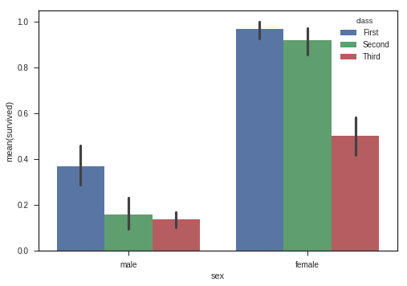

```python
##install depenencies
!pip install kaggle
```

    Requirement already satisfied: kaggle in /usr/local/lib/python3.6/dist-packages (1.5.3)
    Requirement already satisfied: urllib3<1.25,>=1.21.1 in /usr/local/lib/python3.6/dist-packages (from kaggle) (1.22)
    Requirement already satisfied: six>=1.10 in /usr/local/lib/python3.6/dist-packages (from kaggle) (1.11.0)
    Requirement already satisfied: certifi in /usr/local/lib/python3.6/dist-packages (from kaggle) (2019.3.9)
    Requirement already satisfied: python-dateutil in /usr/local/lib/python3.6/dist-packages (from kaggle) (2.5.3)
    Requirement already satisfied: requests in /usr/local/lib/python3.6/dist-packages (from kaggle) (2.18.4)
    Requirement already satisfied: tqdm in /usr/local/lib/python3.6/dist-packages (from kaggle) (4.28.1)
    Requirement already satisfied: python-slugify in /usr/local/lib/python3.6/dist-packages (from kaggle) (3.0.2)
    Requirement already satisfied: chardet<3.1.0,>=3.0.2 in /usr/local/lib/python3.6/dist-packages (from requests->kaggle) (3.0.4)
    Requirement already satisfied: idna<2.7,>=2.5 in /usr/local/lib/python3.6/dist-packages (from requests->kaggle) (2.6)
    Requirement already satisfied: text-unidecode==1.2 in /usr/local/lib/python3.6/dist-packages (from python-slugify->kaggle) (1.2)


```python
#upload the credentials of the kaggle account
from google.colab import files
files.upload()
```


<input type="file" id="files-2a656519-66d4-41f1-a5c9-4f959d57e64d" name="files[]" multiple disabled />
<output id="result-2a656519-66d4-41f1-a5c9-4f959d57e64d">
 Upload widget is only available when the cell has been executed in the
 current browser session. Please rerun this cell to enable.
 </output>
 <script src="/nbextensions/google.colab/files.js"></script> 


    Saving kaggle.json to kaggle.json


    {'kaggle.json': b'{"username":"lahorekid","key":"1e1a362e77ab2e4df43fdc06599c816d"}'}


```python
# The Kaggle API client expects this file to be in ~/.kaggle,
!mkdir -p ~/.kaggle
!cp kaggle.json ~/.kaggle/
```


```python
# This permissions change avoids a warning on Kaggle tool startup.
!chmod 600 ~/.kaggle/kaggle.json
```


```python
# import any data set from Kaggle with this command
!kaggle datasets download -d uciml/iris
```

    Downloading iris.zip to /content
      0% 0.00/3.63k [00:00<?, ?B/s]
    100% 3.63k/3.63k [00:00<00:00, 3.21MB/s]


```python
#see the imported files from kaggle
!ls
```

    iris.zip  kaggle.json  sample_data


```python
# unzip the files
!unzip iris.zip
```

    Archive:  iris.zip
      inflating: Iris.csv                
      inflating: database.sqlite         


```python
#Our data

import pandas as pd

df = pd.read_csv('Iris.csv')
df.head()
```


<div>
<style scoped>
    .dataframe tbody tr th:only-of-type {
        vertical-align: middle;
    }

    .dataframe tbody tr th {
        vertical-align: top;
    }

    .dataframe thead th {
        text-align: right;
    }
</style>
<table border="1" class="dataframe">
  <thead>
    <tr style="text-align: right;">
      <th></th>
      <th>Id</th>
      <th>SepalLengthCm</th>
      <th>SepalWidthCm</th>
      <th>PetalLengthCm</th>
      <th>PetalWidthCm</th>
      <th>Species</th>
    </tr>
  </thead>
  <tbody>
    <tr>
      <th>0</th>
      <td>1</td>
      <td>5.1</td>
      <td>3.5</td>
      <td>1.4</td>
      <td>0.2</td>
      <td>Iris-setosa</td>
    </tr>
    <tr>
      <th>1</th>
      <td>2</td>
      <td>4.9</td>
      <td>3.0</td>
      <td>1.4</td>
      <td>0.2</td>
      <td>Iris-setosa</td>
    </tr>
    <tr>
      <th>2</th>
      <td>3</td>
      <td>4.7</td>
      <td>3.2</td>
      <td>1.3</td>
      <td>0.2</td>
      <td>Iris-setosa</td>
    </tr>
    <tr>
      <th>3</th>
      <td>4</td>
      <td>4.6</td>
      <td>3.1</td>
      <td>1.5</td>
      <td>0.2</td>
      <td>Iris-setosa</td>
    </tr>
    <tr>
      <th>4</th>
      <td>5</td>
      <td>5.0</td>
      <td>3.6</td>
      <td>1.4</td>
      <td>0.2</td>
      <td>Iris-setosa</td>
    </tr>
  </tbody>
</table>
</div>


```python
#last 5 entries

df.tail()
```


<div>
<style scoped>
    .dataframe tbody tr th:only-of-type {
        vertical-align: middle;
    }

    .dataframe tbody tr th {
        vertical-align: top;
    }

    .dataframe thead th {
        text-align: right;
    }
</style>
<table border="1" class="dataframe">
  <thead>
    <tr style="text-align: right;">
      <th></th>
      <th>Id</th>
      <th>SepalLengthCm</th>
      <th>SepalWidthCm</th>
      <th>PetalLengthCm</th>
      <th>PetalWidthCm</th>
      <th>Species</th>
    </tr>
  </thead>
  <tbody>
    <tr>
      <th>145</th>
      <td>146</td>
      <td>6.7</td>
      <td>3.0</td>
      <td>5.2</td>
      <td>2.3</td>
      <td>Iris-virginica</td>
    </tr>
    <tr>
      <th>146</th>
      <td>147</td>
      <td>6.3</td>
      <td>2.5</td>
      <td>5.0</td>
      <td>1.9</td>
      <td>Iris-virginica</td>
    </tr>
    <tr>
      <th>147</th>
      <td>148</td>
      <td>6.5</td>
      <td>3.0</td>
      <td>5.2</td>
      <td>2.0</td>
      <td>Iris-virginica</td>
    </tr>
    <tr>
      <th>148</th>
      <td>149</td>
      <td>6.2</td>
      <td>3.4</td>
      <td>5.4</td>
      <td>2.3</td>
      <td>Iris-virginica</td>
    </tr>
    <tr>
      <th>149</th>
      <td>150</td>
      <td>5.9</td>
      <td>3.0</td>
      <td>5.1</td>
      <td>1.8</td>
      <td>Iris-virginica</td>
    </tr>
  </tbody>
</table>
</div>


```python
# check data type

df.info()
```

    <class 'pandas.core.frame.DataFrame'>
    RangeIndex: 150 entries, 0 to 149
    Data columns (total 6 columns):
    Id               150 non-null int64
    SepalLengthCm    150 non-null float64
    SepalWidthCm     150 non-null float64
    PetalLengthCm    150 non-null float64
    PetalWidthCm     150 non-null float64
    Species          150 non-null object
    dtypes: float64(4), int64(1), object(1)
    memory usage: 7.1+ KB


```python
#describe the data

df.describe()
```


<div>
<style scoped>
    .dataframe tbody tr th:only-of-type {
        vertical-align: middle;
    }

    .dataframe tbody tr th {
        vertical-align: top;
    }

    .dataframe thead th {
        text-align: right;
    }
</style>
<table border="1" class="dataframe">
  <thead>
    <tr style="text-align: right;">
      <th></th>
      <th>Id</th>
      <th>SepalLengthCm</th>
      <th>SepalWidthCm</th>
      <th>PetalLengthCm</th>
      <th>PetalWidthCm</th>
    </tr>
  </thead>
  <tbody>
    <tr>
      <th>count</th>
      <td>150.000000</td>
      <td>150.000000</td>
      <td>150.000000</td>
      <td>150.000000</td>
      <td>150.000000</td>
    </tr>
    <tr>
      <th>mean</th>
      <td>75.500000</td>
      <td>5.843333</td>
      <td>3.054000</td>
      <td>3.758667</td>
      <td>1.198667</td>
    </tr>
    <tr>
      <th>std</th>
      <td>43.445368</td>
      <td>0.828066</td>
      <td>0.433594</td>
      <td>1.764420</td>
      <td>0.763161</td>
    </tr>
    <tr>
      <th>min</th>
      <td>1.000000</td>
      <td>4.300000</td>
      <td>2.000000</td>
      <td>1.000000</td>
      <td>0.100000</td>
    </tr>
    <tr>
      <th>25%</th>
      <td>38.250000</td>
      <td>5.100000</td>
      <td>2.800000</td>
      <td>1.600000</td>
      <td>0.300000</td>
    </tr>
    <tr>
      <th>50%</th>
      <td>75.500000</td>
      <td>5.800000</td>
      <td>3.000000</td>
      <td>4.350000</td>
      <td>1.300000</td>
    </tr>
    <tr>
      <th>75%</th>
      <td>112.750000</td>
      <td>6.400000</td>
      <td>3.300000</td>
      <td>5.100000</td>
      <td>1.800000</td>
    </tr>
    <tr>
      <th>max</th>
      <td>150.000000</td>
      <td>7.900000</td>
      <td>4.400000</td>
      <td>6.900000</td>
      <td>2.500000</td>
    </tr>
  </tbody>
</table>
</div>


```python
#find null values if any

df.isnull().any()
```


    Id               False
    SepalLengthCm    False
    SepalWidthCm     False
    PetalLengthCm    False
    PetalWidthCm     False
    Species          False
    dtype: bool


```python
#describe the data in a column
df.describe(include=['O'])
```


<div>
<style scoped>
    .dataframe tbody tr th:only-of-type {
        vertical-align: middle;
    }

    .dataframe tbody tr th {
        vertical-align: top;
    }

    .dataframe thead th {
        text-align: right;
    }
</style>
<table border="1" class="dataframe">
  <thead>
    <tr style="text-align: right;">
      <th></th>
      <th>Species</th>
    </tr>
  </thead>
  <tbody>
    <tr>
      <th>count</th>
      <td>150</td>
    </tr>
    <tr>
      <th>unique</th>
      <td>3</td>
    </tr>
    <tr>
      <th>top</th>
      <td>Iris-versicolor</td>
    </tr>
    <tr>
      <th>freq</th>
      <td>50</td>
    </tr>
  </tbody>
</table>
</div>


```python
# Distribution plot
import pandas as pd
import seaborn as sb
from matplotlib import pyplot as plt
matplotlib.interactive(True)
df = sb.load_dataset('iris')
sb.distplot(df['petal_length'],kde = False)
plt.show()
```

    /usr/local/lib/python3.6/dist-packages/matplotlib/axes/_axes.py:6521: MatplotlibDeprecationWarning: 
    The 'normed' kwarg was deprecated in Matplotlib 2.1 and will be removed in 3.1. Use 'density' instead.
      alternative="'density'", removal="3.1")


```python
 #Kernel density estimation plot.
  
df = sb.load_dataset('iris')
sb.distplot(df['petal_length'],hist=False)
plt.show()
```


```python
#Fitting Parametric Distribution
import pandas as pd
import matplotlib
import seaborn as sb
df = sb.load_dataset('iris')
sb.distplot(df['petal_length'])
plt.show()
```

    /usr/local/lib/python3.6/dist-packages/matplotlib/axes/_axes.py:6521: MatplotlibDeprecationWarning: 
    The 'normed' kwarg was deprecated in Matplotlib 2.1 and will be removed in 3.1. Use 'density' instead.
      alternative="'density'", removal="3.1")


```python
#Scatter Plot

df = sb.load_dataset('iris')
sb.jointplot(x = 'petal_length',y = 'petal_width',data = df)
plt.show()


```

    /usr/local/lib/python3.6/dist-packages/matplotlib/axes/_axes.py:6521: MatplotlibDeprecationWarning: 
    The 'normed' kwarg was deprecated in Matplotlib 2.1 and will be removed in 3.1. Use 'density' instead.
      alternative="'density'", removal="3.1")


```python
#Hexbin Plot


df = sb.load_dataset('iris')
sb.jointplot(x = 'petal_length',y = 'petal_width',data = df,kind = 'hex')
plt.show()
```

    /usr/local/lib/python3.6/dist-packages/matplotlib/axes/_axes.py:6521: MatplotlibDeprecationWarning: 
    The 'normed' kwarg was deprecated in Matplotlib 2.1 and will be removed in 3.1. Use 'density' instead.
      alternative="'density'", removal="3.1")


```python
#Kernel Density Estimation


df = sb.load_dataset('iris')
sb.jointplot(x = 'petal_length',y = 'petal_width',data = df,kind = 'hex')
plt.show()
```

    /usr/local/lib/python3.6/dist-packages/matplotlib/axes/_axes.py:6521: MatplotlibDeprecationWarning: 
    The 'normed' kwarg was deprecated in Matplotlib 2.1 and will be removed in 3.1. Use 'density' instead.
      alternative="'density'", removal="3.1")


```python
#Pairwise Relationship


df = sb.load_dataset('iris')
sb.set_style("ticks")
sb.pairplot(df,hue = 'species',diag_kind = "kde",kind = "scatter",palette = "husl")
plt.show()
```


```python
#Categorical Scatter Plots

#Stirplot

df = sb.load_dataset('iris')
sb.stripplot(x = "species", y = "petal_length", data = df)
plt.show()
```


```python
#Dots expanded
df = sb.load_dataset('iris')
sb.stripplot(x = "species", y = "petal_length", data = df, jitter = True)
plt.show()
```


```python
#Expanded in different way
df = sb.load_dataset('iris')
sb.swarmplot(x = "species", y = "petal_length", data = df)
plt.show()
```


```python
#Box Plots

df = sb.load_dataset('iris')
sb.boxplot(x = "species", y = "petal_length", data = df)
plt.show()
```

    /usr/local/lib/python3.6/dist-packages/seaborn/categorical.py:454: FutureWarning: remove_na is deprecated and is a private function. Do not use.
      box_data = remove_na(group_data)


```python
#Violin plot

df = sb.load_dataset('tips')
sb.violinplot(x = "day", y = "total_bill", data=df)
plt.show()
```

    /usr/local/lib/python3.6/dist-packages/seaborn/categorical.py:588: FutureWarning: remove_na is deprecated and is a private function. Do not use.
      kde_data = remove_na(group_data)
    /usr/local/lib/python3.6/dist-packages/seaborn/categorical.py:816: FutureWarning: remove_na is deprecated and is a private function. Do not use.
      violin_data = remove_na(group_data)


```python
#By gender

df = sb.load_dataset('tips')
sb.violinplot(x = "day", y = "total_bill",hue = 'sex', data = df)
plt.show()
```

    /usr/local/lib/python3.6/dist-packages/seaborn/categorical.py:637: FutureWarning: remove_na is deprecated and is a private function. Do not use.
      kde_data = remove_na(group_data[hue_mask])
    /usr/local/lib/python3.6/dist-packages/seaborn/categorical.py:932: FutureWarning: remove_na is deprecated and is a private function. Do not use.
      violin_data = remove_na(group_data[hue_mask])


```python
#Joined

df = sb.load_dataset('tips')
sb.violinplot(x = "day", y="total_bill",hue = 'sex', data = df)
plt.show()
```

    /usr/local/lib/python3.6/dist-packages/seaborn/categorical.py:637: FutureWarning: remove_na is deprecated and is a private function. Do not use.
      kde_data = remove_na(group_data[hue_mask])
    /usr/local/lib/python3.6/dist-packages/seaborn/categorical.py:932: FutureWarning: remove_na is deprecated and is a private function. Do not use.
      violin_data = remove_na(group_data[hue_mask])


```python
#Bar Plot

df = sb.load_dataset('titanic')
sb.barplot(x = "sex", y = "survived", hue = "class", data = df)
plt.show()
```

    /usr/local/lib/python3.6/dist-packages/seaborn/categorical.py:1468: FutureWarning: remove_na is deprecated and is a private function. Do not use.
      stat_data = remove_na(group_data[hue_mask])





```python
#By count

df = sb.load_dataset('titanic')
sb.countplot(x = "class", data = df, palette = "Blues");
plt.show()
```

    /usr/local/lib/python3.6/dist-packages/seaborn/categorical.py:1428: FutureWarning: remove_na is deprecated and is a private function. Do not use.
      stat_data = remove_na(group_data)


```python
#By point

df = sb.load_dataset('titanic')
sb.pointplot(x = "sex", y = "survived", hue = "class", data = df)
plt.show()
```

    /usr/local/lib/python3.6/dist-packages/seaborn/categorical.py:1468: FutureWarning: remove_na is deprecated and is a private function. Do not use.
      stat_data = remove_na(group_data[hue_mask])


```python
#Boxplot horizontol

df = sb.load_dataset('iris')
sb.boxplot(data = df, orient = "h")
plt.show()
```

    /usr/local/lib/python3.6/dist-packages/seaborn/categorical.py:454: FutureWarning: remove_na is deprecated and is a private function. Do not use.
      box_data = remove_na(group_data)


```python
#factor plot

df = sb.load_dataset('exercise')
sb.factorplot(x = "time", y = "pulse", hue = "kind" ,data = df);
plt.show()
```

    /usr/local/lib/python3.6/dist-packages/seaborn/categorical.py:1468: FutureWarning: remove_na is deprecated and is a private function. Do not use.
      stat_data = remove_na(group_data[hue_mask])


```python
#violin factor plot

df = sb.load_dataset('exercise')
sb.factorplot(x = "time", y = "pulse", hue = "kind", kind = 'violin',data = df);
plt.show()
```

    /usr/local/lib/python3.6/dist-packages/seaborn/categorical.py:637: FutureWarning: remove_na is deprecated and is a private function. Do not use.
      kde_data = remove_na(group_data[hue_mask])
    /usr/local/lib/python3.6/dist-packages/seaborn/categorical.py:932: FutureWarning: remove_na is deprecated and is a private function. Do not use.
      violin_data = remove_na(group_data[hue_mask])


```python
#By column

df = sb.load_dataset('exercise')
sb.factorplot(x = "time", y = "pulse", hue = "kind", kind = 'violin', col = "diet", data = df);
plt.show()
```

    /usr/local/lib/python3.6/dist-packages/seaborn/categorical.py:637: FutureWarning: remove_na is deprecated and is a private function. Do not use.
      kde_data = remove_na(group_data[hue_mask])
    /usr/local/lib/python3.6/dist-packages/seaborn/categorical.py:932: FutureWarning: remove_na is deprecated and is a private function. Do not use.
      violin_data = remove_na(group_data[hue_mask])


```python
#Factorplot by histogram

df = sb.load_dataset('titanic')
sb.factorplot("alive", col = "deck", col_wrap = 3,data = df[df.deck.notnull()],kind = "count")
plt.show()
```

    /usr/local/lib/python3.6/dist-packages/seaborn/categorical.py:1428: FutureWarning: remove_na is deprecated and is a private function. Do not use.
      stat_data = remove_na(group_data)


```python
#Linear Regression Models

df = sb.load_dataset('tips')
sb.regplot(x = "total_bill", y = "tip", data = df)
sb.lmplot(x = "total_bill", y = "tip", data = df)
plt.show()
```


```python
#Facet grid

df = sb.load_dataset('tips')
g = sb.FacetGrid(df, col = "time")
g.map(plt.hist, "tip")
plt.show()
```


```python
#Pair Grid

df = sb.load_dataset('iris')
g = sb.PairGrid(df)
g.map(plt.scatter);
plt.show()
```


```python
#Line plot

import pandas as pd
import numpy as np

df = pd.DataFrame(np.random.randn(10,4),index=pd.date_range('1/1/2000',periods=10), columns=list('ABCD'))

df.plot()
```


    <matplotlib.axes._subplots.AxesSubplot at 0x7fce43002cf8>


```python
#Barplot

df = pd.DataFrame(np.random.rand(10,4),columns=['a','b','c','d'])
df.plot.bar()
```


    <matplotlib.axes._subplots.AxesSubplot at 0x7fce44e4c2e8>


```python
#Barplot stacked
df = pd.DataFrame(np.random.rand(10,4),columns=['a','b','c','d'])
df.plot.bar(stacked=True)
```


    <matplotlib.axes._subplots.AxesSubplot at 0x7fce44baaa90>


```python
#Horizontol barplot

df = pd.DataFrame(np.random.rand(10,4),columns=['a','b','c','d'])

df.plot.barh(stacked=True)
```


    <matplotlib.axes._subplots.AxesSubplot at 0x7fce42b1b240>


```python
#Histogram

df = pd.DataFrame(np.random.rand(10,4),columns=['a','b','c','d'])

df.plot.hist()
```


    <matplotlib.axes._subplots.AxesSubplot at 0x7fce427b6dd8>


```python
#Area  plot
df = pd.DataFrame(np.random.rand(10, 4), columns=['a', 'b', 'c', 'd'])
df.plot.area()
```


    <matplotlib.axes._subplots.AxesSubplot at 0x7fce427c3e48>


```python
#Scatter plot

df = pd.DataFrame(np.random.rand(50, 4), columns=['a', 'b', 'c', 'd'])
df.plot.scatter(x='a', y='b')
```

    'c' argument looks like a single numeric RGB or RGBA sequence, which should be avoided as value-mapping will have precedence in case its length matches with 'x' & 'y'.  Please use a 2-D array with a single row if you really want to specify the same RGB or RGBA value for all points.


    <matplotlib.axes._subplots.AxesSubplot at 0x7fce425a9b38>


```python
#Pie chart


df = pd.DataFrame(3 * np.random.rand(4), index=['a', 'b', 'c', 'd'], columns=['x'])
df.plot.pie(subplots=True)
```


    array([<matplotlib.axes._subplots.AxesSubplot object at 0x7fce425df4a8>],
          dtype=object)


```python
#Graph

x = np.arange(0,10) 
y = x ^ 2 
#Labeling the Axes and Title
plt.title("Graph Drawing") 
plt.xlabel("Time") 
plt.ylabel("Distance") 
#Simple Plot
plt.plot(x,y)
```


    [<matplotlib.lines.Line2D at 0x7fce425a98d0>]


```python
#Heatmap
from pandas import DataFrame
import matplotlib.pyplot as plt

data=[{2,3,4,1},{6,3,5,2},{6,3,5,4},{3,7,5,4},{2,8,1,5}]
Index= ['I1', 'I2','I3','I4','I5']
Cols = ['C1', 'C2', 'C3','C4']
df = DataFrame(data, index=Index, columns=Cols)

plt.pcolor(df)
plt.show()
```


```python
#Bubble chart

# create data
x = np.random.rand(40)
y = np.random.rand(40)
z = np.random.rand(40)
colors = np.random.rand(40) 
# use the scatter function
plt.scatter(x, y, s=z*1000,c=colors)
plt.show
```


    <function matplotlib.pyplot.show>


