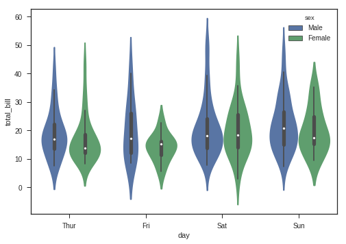

```python
#XGBoost

#XGBoost is the leading model for working with standard tabular data 
#(the type of data you store in Pandas DataFrames, as opposed to more exotic types of data like images and videos). 
#XGBoost models dominate many Kaggle competitions.

#Ideal for Classification and Regression


```


```python
#Regression with XGBOOST

#PIMA INDIANS DATASET
```


```python
!pip install scikit-plot
```

    Collecting scikit-plot
      Downloading https://files.pythonhosted.org/packages/7c/47/32520e259340c140a4ad27c1b97050dd3254fdc517b1d59974d47037510e/scikit_plot-0.3.7-py3-none-any.whl
    Requirement already satisfied: joblib>=0.10 in /usr/local/lib/python3.6/dist-packages (from scikit-plot) (0.12.5)
    Requirement already satisfied: scipy>=0.9 in /usr/local/lib/python3.6/dist-packages (from scikit-plot) (1.2.1)
    Requirement already satisfied: matplotlib>=1.4.0 in /usr/local/lib/python3.6/dist-packages (from scikit-plot) (3.0.3)
    Requirement already satisfied: scikit-learn>=0.18 in /usr/local/lib/python3.6/dist-packages (from scikit-plot) (0.20.3)
    Requirement already satisfied: numpy>=1.8.2 in /usr/local/lib/python3.6/dist-packages (from scipy>=0.9->scikit-plot) (1.16.2)
    Requirement already satisfied: kiwisolver>=1.0.1 in /usr/local/lib/python3.6/dist-packages (from matplotlib>=1.4.0->scikit-plot) (1.0.1)
    Requirement already satisfied: pyparsing!=2.0.4,!=2.1.2,!=2.1.6,>=2.0.1 in /usr/local/lib/python3.6/dist-packages (from matplotlib>=1.4.0->scikit-plot) (2.4.0)
    Requirement already satisfied: cycler>=0.10 in /usr/local/lib/python3.6/dist-packages (from matplotlib>=1.4.0->scikit-plot) (0.10.0)
    Requirement already satisfied: python-dateutil>=2.1 in /usr/local/lib/python3.6/dist-packages (from matplotlib>=1.4.0->scikit-plot) (2.5.3)
    Requirement already satisfied: setuptools in /usr/local/lib/python3.6/dist-packages (from kiwisolver>=1.0.1->matplotlib>=1.4.0->scikit-plot) (40.9.0)
    Requirement already satisfied: six in /usr/local/lib/python3.6/dist-packages (from cycler>=0.10->matplotlib>=1.4.0->scikit-plot) (1.11.0)
    Installing collected packages: scikit-plot
    Successfully installed scikit-plot-0.3.7


```python
import pandas as pd
import numpy as np
import altair as alt
import matplotlib.pyplot as plt
from sklearn import metrics
from sklearn.metrics import classification_report
from  sklearn.metrics import precision_recall_fscore_support

from xgboost import XGBClassifier
from xgboost import XGBRegressor
from sklearn.model_selection import train_test_split
from sklearn.metrics import accuracy_score
import scikitplot as skplt
```


```python
url = 'https://raw.githubusercontent.com/aquarius31/Pima-Indians-Dataset/master/diabetes.csv'
df = pd.read_csv(url)
# Dataset is now stored in a Pandas Dataframe
```


```python
df.head()
```


<div>
<style scoped>
    .dataframe tbody tr th:only-of-type {
        vertical-align: middle;
    }

    .dataframe tbody tr th {
        vertical-align: top;
    }

    .dataframe thead th {
        text-align: right;
    }
</style>
<table border="1" class="dataframe">
  <thead>
    <tr style="text-align: right;">
      <th></th>
      <th>Pregnancies</th>
      <th>Glucose</th>
      <th>BloodPressure</th>
      <th>SkinThickness</th>
      <th>Insulin</th>
      <th>BMI</th>
      <th>DiabetesPedigreeFunction</th>
      <th>Age</th>
      <th>Outcome</th>
    </tr>
  </thead>
  <tbody>
    <tr>
      <th>0</th>
      <td>6</td>
      <td>148</td>
      <td>72</td>
      <td>35</td>
      <td>0</td>
      <td>33.6</td>
      <td>0.627</td>
      <td>50</td>
      <td>1</td>
    </tr>
    <tr>
      <th>1</th>
      <td>1</td>
      <td>85</td>
      <td>66</td>
      <td>29</td>
      <td>0</td>
      <td>26.6</td>
      <td>0.351</td>
      <td>31</td>
      <td>0</td>
    </tr>
    <tr>
      <th>2</th>
      <td>8</td>
      <td>183</td>
      <td>64</td>
      <td>0</td>
      <td>0</td>
      <td>23.3</td>
      <td>0.672</td>
      <td>32</td>
      <td>1</td>
    </tr>
    <tr>
      <th>3</th>
      <td>1</td>
      <td>89</td>
      <td>66</td>
      <td>23</td>
      <td>94</td>
      <td>28.1</td>
      <td>0.167</td>
      <td>21</td>
      <td>0</td>
    </tr>
    <tr>
      <th>4</th>
      <td>0</td>
      <td>137</td>
      <td>40</td>
      <td>35</td>
      <td>168</td>
      <td>43.1</td>
      <td>2.288</td>
      <td>33</td>
      <td>1</td>
    </tr>
  </tbody>
</table>
</div>


```python
df.columns
```


    Index(['Pregnancies', 'Glucose', 'BloodPressure', 'SkinThickness', 'Insulin',
           'BMI', 'DiabetesPedigreeFunction', 'Age', 'Outcome'],
          dtype='object')


```python
X = df[['Pregnancies', 'Glucose', 'BloodPressure', 'SkinThickness', 'Insulin','BMI', 'DiabetesPedigreeFunction', 'Age']]
```


```python
X.head()
```


<div>
<style scoped>
    .dataframe tbody tr th:only-of-type {
        vertical-align: middle;
    }

    .dataframe tbody tr th {
        vertical-align: top;
    }

    .dataframe thead th {
        text-align: right;
    }
</style>
<table border="1" class="dataframe">
  <thead>
    <tr style="text-align: right;">
      <th></th>
      <th>Pregnancies</th>
      <th>Glucose</th>
      <th>BloodPressure</th>
      <th>SkinThickness</th>
      <th>Insulin</th>
      <th>BMI</th>
      <th>DiabetesPedigreeFunction</th>
      <th>Age</th>
    </tr>
  </thead>
  <tbody>
    <tr>
      <th>0</th>
      <td>6</td>
      <td>148</td>
      <td>72</td>
      <td>35</td>
      <td>0</td>
      <td>33.6</td>
      <td>0.627</td>
      <td>50</td>
    </tr>
    <tr>
      <th>1</th>
      <td>1</td>
      <td>85</td>
      <td>66</td>
      <td>29</td>
      <td>0</td>
      <td>26.6</td>
      <td>0.351</td>
      <td>31</td>
    </tr>
    <tr>
      <th>2</th>
      <td>8</td>
      <td>183</td>
      <td>64</td>
      <td>0</td>
      <td>0</td>
      <td>23.3</td>
      <td>0.672</td>
      <td>32</td>
    </tr>
    <tr>
      <th>3</th>
      <td>1</td>
      <td>89</td>
      <td>66</td>
      <td>23</td>
      <td>94</td>
      <td>28.1</td>
      <td>0.167</td>
      <td>21</td>
    </tr>
    <tr>
      <th>4</th>
      <td>0</td>
      <td>137</td>
      <td>40</td>
      <td>35</td>
      <td>168</td>
      <td>43.1</td>
      <td>2.288</td>
      <td>33</td>
    </tr>
  </tbody>
</table>
</div>


```python
y = df[['Outcome']]
```


```python
y.head()
```


<div>
<style scoped>
    .dataframe tbody tr th:only-of-type {
        vertical-align: middle;
    }

    .dataframe tbody tr th {
        vertical-align: top;
    }

    .dataframe thead th {
        text-align: right;
    }
</style>
<table border="1" class="dataframe">
  <thead>
    <tr style="text-align: right;">
      <th></th>
      <th>Outcome</th>
    </tr>
  </thead>
  <tbody>
    <tr>
      <th>0</th>
      <td>1</td>
    </tr>
    <tr>
      <th>1</th>
      <td>0</td>
    </tr>
    <tr>
      <th>2</th>
      <td>1</td>
    </tr>
    <tr>
      <th>3</th>
      <td>0</td>
    </tr>
    <tr>
      <th>4</th>
      <td>1</td>
    </tr>
  </tbody>
</table>
</div>


```python
# split data into train and test sets
seed = 7
test_size = 0.33
X_train, X_test, y_train, y_test = train_test_split(X, y, test_size=test_size,
    random_state=seed)
```


```python
#Feature Scaling
from sklearn.preprocessing import StandardScaler
sc=StandardScaler()
X_train = sc.fit_transform(X_train)
X_test = sc.transform(X_test)
```

    /usr/local/lib/python3.6/dist-packages/sklearn/preprocessing/data.py:645: DataConversionWarning: Data with input dtype int64, float64 were all converted to float64 by StandardScaler.
      return self.partial_fit(X, y)
    /usr/local/lib/python3.6/dist-packages/sklearn/base.py:464: DataConversionWarning: Data with input dtype int64, float64 were all converted to float64 by StandardScaler.
      return self.fit(X, **fit_params).transform(X)
    /usr/local/lib/python3.6/dist-packages/ipykernel_launcher.py:4: DataConversionWarning: Data with input dtype int64, float64 were all converted to float64 by StandardScaler.
      after removing the cwd from sys.path.


```python
#Building model
model = XGBClassifier()
#n_estimators=1000, learning_rate=0.05)
```


```python
#model = XGBClassifier(silent=False, 
                     # scale_pos_weight=1,
                      #learning_rate=0.01,  
                      #colsample_bytree = 0.4,
                      #subsample = 0.8,
                      #objective='binary:logistic', 
                      #n_estimators=1000, 
                      #reg_alpha = 0.3,
                      #max_depth=4, 
                      #gamma=10)
```


```python
model.fit(X_train,y_train)
```

    /usr/local/lib/python3.6/dist-packages/sklearn/preprocessing/label.py:219: DataConversionWarning: A column-vector y was passed when a 1d array was expected. Please change the shape of y to (n_samples, ), for example using ravel().
      y = column_or_1d(y, warn=True)
    /usr/local/lib/python3.6/dist-packages/sklearn/preprocessing/label.py:252: DataConversionWarning: A column-vector y was passed when a 1d array was expected. Please change the shape of y to (n_samples, ), for example using ravel().
      y = column_or_1d(y, warn=True)


    XGBClassifier(base_score=0.5, booster='gbtree', colsample_bylevel=1,
           colsample_bytree=1, gamma=0, learning_rate=0.1, max_delta_step=0,
           max_depth=3, min_child_weight=1, missing=None, n_estimators=100,
           n_jobs=1, nthread=None, objective='binary:logistic', random_state=0,
           reg_alpha=0, reg_lambda=1, scale_pos_weight=1, seed=None,
           silent=True, subsample=1)


```python
#model.fit(X_train, y_train, early_stopping_rounds=10, 
             #eval_set=[(X_test, y_test)], verbose=False)
```


```python
y_pred = model.predict(X_test)
```


```python
accuracy = accuracy_score(y_pred, y_test)
```


```python
#plot.confusion_matrix(y_true, y_pred)
#plt.show()
```


```python
print("Accuracy: %.2f%%" % (accuracy * 100.0))
```

    Accuracy: 77.95%


```python
# Making the Confusion Matrix
from sklearn.metrics import confusion_matrix
cm = confusion_matrix(y_test, y_pred)
```


```python
print(classification_report(y_test, y_pred))
```

                  precision    recall  f1-score   support
    
               0       0.75      0.92      0.83        90
               1       0.68      0.36      0.47        42
    
       micro avg       0.74      0.74      0.74       132
       macro avg       0.72      0.64      0.65       132
    weighted avg       0.73      0.74      0.72       132
    


```python
 print(cm)
```

    [[136  26]
     [ 30  62]]


```python
df.model
```


    ---------------------------------------------------------------------------

    AttributeError                            Traceback (most recent call last)

    <ipython-input-68-67adbe1db793> in <module>()
    ----> 1 df.model
    

    /usr/local/lib/python3.6/dist-packages/pandas/core/generic.py in __getattr__(self, name)
       4374             if self._info_axis._can_hold_identifiers_and_holds_name(name):
       4375                 return self[name]
    -> 4376             return object.__getattribute__(self, name)
       4377 
       4378     def __setattr__(self, name, value):


    AttributeError: 'DataFrame' object has no attribute 'model'


```python
#!pip install scikit-plot
import scikitplot as skplt
skplt.metrics.plot_confusion_matrix(y_test, y_pred, normalize=True)
plt.show()
```


```python
import scikitplot as skplt
nb = XGBClassifier()
nb = nb.fit(X_train, y_train)
y_probas = nb.predict_proba(X_test)
skplt.metrics.plot_roc(y_test, y_probas)
plt.show()
```

    /usr/local/lib/python3.6/dist-packages/sklearn/preprocessing/label.py:219: DataConversionWarning: A column-vector y was passed when a 1d array was expected. Please change the shape of y to (n_samples, ), for example using ravel().
      y = column_or_1d(y, warn=True)
    /usr/local/lib/python3.6/dist-packages/sklearn/preprocessing/label.py:252: DataConversionWarning: A column-vector y was passed when a 1d array was expected. Please change the shape of y to (n_samples, ), for example using ravel().
      y = column_or_1d(y, warn=True)





```python
!pip install sklearn-evaluation
```

    Collecting sklearn-evaluation
      Downloading https://files.pythonhosted.org/packages/51/cb/797d9ccb9de85fed54bd418b4e726fb8d14450c0c1a9251f444bb4e5e3b3/sklearn-evaluation-0.4.tar.gz
    Requirement already satisfied: scikit-learn in /usr/local/lib/python3.6/dist-packages (from sklearn-evaluation) (0.20.3)
    Requirement already satisfied: matplotlib in /usr/local/lib/python3.6/dist-packages (from sklearn-evaluation) (3.0.3)
    Requirement already satisfied: six in /usr/local/lib/python3.6/dist-packages (from sklearn-evaluation) (1.11.0)
    Requirement already satisfied: decorator in /usr/local/lib/python3.6/dist-packages (from sklearn-evaluation) (4.4.0)
    Requirement already satisfied: scipy>=0.13.3 in /usr/local/lib/python3.6/dist-packages (from scikit-learn->sklearn-evaluation) (1.2.1)
    Requirement already satisfied: numpy>=1.8.2 in /usr/local/lib/python3.6/dist-packages (from scikit-learn->sklearn-evaluation) (1.16.2)
    Requirement already satisfied: cycler>=0.10 in /usr/local/lib/python3.6/dist-packages (from matplotlib->sklearn-evaluation) (0.10.0)
    Requirement already satisfied: pyparsing!=2.0.4,!=2.1.2,!=2.1.6,>=2.0.1 in /usr/local/lib/python3.6/dist-packages (from matplotlib->sklearn-evaluation) (2.4.0)
    Requirement already satisfied: python-dateutil>=2.1 in /usr/local/lib/python3.6/dist-packages (from matplotlib->sklearn-evaluation) (2.5.3)
    Requirement already satisfied: kiwisolver>=1.0.1 in /usr/local/lib/python3.6/dist-packages (from matplotlib->sklearn-evaluation) (1.0.1)
    Requirement already satisfied: setuptools in /usr/local/lib/python3.6/dist-packages (from kiwisolver>=1.0.1->matplotlib->sklearn-evaluation) (40.9.0)
    Building wheels for collected packages: sklearn-evaluation
      Building wheel for sklearn-evaluation (setup.py) ... [?25ldone
    [?25h  Stored in directory: /root/.cache/pip/wheels/be/3c/51/97b3f06627b632815707e6f9dd71fa2744ef8f1ef4005ea5ed
    Successfully built sklearn-evaluation
    Installing collected packages: sklearn-evaluation
    Successfully installed sklearn-evaluation-0.4


```python
import matplotlib.pyplot as plt
from sklearn_evaluation import plot

import scikitplot as skplt

est = XGBClassifier()
est.fit(X_train, y_train)

y_pred = est.predict(X_test)
y_score = est.predict_proba(X_test)
y_true = y_test

plot.precision_recall(y_true, y_score)
```

    /usr/local/lib/python3.6/dist-packages/sklearn/preprocessing/label.py:219: DataConversionWarning: A column-vector y was passed when a 1d array was expected. Please change the shape of y to (n_samples, ), for example using ravel().
      y = column_or_1d(y, warn=True)
    /usr/local/lib/python3.6/dist-packages/sklearn/preprocessing/label.py:252: DataConversionWarning: A column-vector y was passed when a 1d array was expected. Please change the shape of y to (n_samples, ), for example using ravel().
      y = column_or_1d(y, warn=True)


    <matplotlib.axes._subplots.AxesSubplot at 0x7f3adc06ee10>


```python

est = XGBClassifier()
est.fit(X_train, y_train)

y_pred = est.predict(X_test)
y_score = est.predict_proba(X_test)
y_true = y_test

plot.roc(y_true, y_score)
```

    /usr/local/lib/python3.6/dist-packages/sklearn/preprocessing/label.py:219: DataConversionWarning: A column-vector y was passed when a 1d array was expected. Please change the shape of y to (n_samples, ), for example using ravel().
      y = column_or_1d(y, warn=True)
    /usr/local/lib/python3.6/dist-packages/sklearn/preprocessing/label.py:252: DataConversionWarning: A column-vector y was passed when a 1d array was expected. Please change the shape of y to (n_samples, ), for example using ravel().
      y = column_or_1d(y, warn=True)


    <matplotlib.axes._subplots.AxesSubplot at 0x7f3adc047b38>


```python

# Applying k-Fold Cross Validation
#from sklearn.model_selection import cross_val_score
#accuracies = cross_val_score(estimator = model, X = X_train, y = y_train, cv = 10)
#accuracies.mean()
#accuracies.std()
```


```python
#print(accuracies)
```


```python
#Visualize 

from xgboost import plot_tree, plot_importance, to_graphviz
```


```python

ax = plot_tree(model)
fig = ax.figure
fig.set_size_inches(30, 5)
```


```python
ax = plot_importance(model)
fig = ax.figure
fig.set_size_inches(10, 8)
```


```python
# save model to file
import pickle
pickle.dump(model, open("pima.pickle.dat", "wb"))
```


```python

#Social Network Ads


```


```python
url = 'https://raw.githubusercontent.com/SteffiPeTaffy/machineLearningAZ/master/Machine%20Learning%20A-Z%20Template%20Folder/Part%203%20-%20Classification/Section%2017%20-%20Kernel%20SVM/Social_Network_Ads.csv'
df = pd.read_csv(url)
# Dataset is now stored in a Pandas Dataframe
```


```python
df.head()
```


<div>
<style scoped>
    .dataframe tbody tr th:only-of-type {
        vertical-align: middle;
    }

    .dataframe tbody tr th {
        vertical-align: top;
    }

    .dataframe thead th {
        text-align: right;
    }
</style>
<table border="1" class="dataframe">
  <thead>
    <tr style="text-align: right;">
      <th></th>
      <th>User ID</th>
      <th>Gender</th>
      <th>Age</th>
      <th>EstimatedSalary</th>
      <th>Purchased</th>
    </tr>
  </thead>
  <tbody>
    <tr>
      <th>0</th>
      <td>15624510</td>
      <td>Male</td>
      <td>19.0</td>
      <td>19000.0</td>
      <td>0</td>
    </tr>
    <tr>
      <th>1</th>
      <td>15810944</td>
      <td>Male</td>
      <td>35.0</td>
      <td>20000.0</td>
      <td>0</td>
    </tr>
    <tr>
      <th>2</th>
      <td>15668575</td>
      <td>Female</td>
      <td>26.0</td>
      <td>43000.0</td>
      <td>0</td>
    </tr>
    <tr>
      <th>3</th>
      <td>15603246</td>
      <td>Female</td>
      <td>27.0</td>
      <td>57000.0</td>
      <td>0</td>
    </tr>
    <tr>
      <th>4</th>
      <td>15804002</td>
      <td>Male</td>
      <td>19.0</td>
      <td>76000.0</td>
      <td>0</td>
    </tr>
  </tbody>
</table>
</div>


```python
df.columns
```


    Index(['User ID', 'Gender', 'Age', 'EstimatedSalary', 'Purchased'], dtype='object')


```python
X = df[['Gender', 'Age', 'EstimatedSalary']]
```


```python
X.head()
```


<div>
<style scoped>
    .dataframe tbody tr th:only-of-type {
        vertical-align: middle;
    }

    .dataframe tbody tr th {
        vertical-align: top;
    }

    .dataframe thead th {
        text-align: right;
    }
</style>
<table border="1" class="dataframe">
  <thead>
    <tr style="text-align: right;">
      <th></th>
      <th>Gender</th>
      <th>Age</th>
      <th>EstimatedSalary</th>
    </tr>
  </thead>
  <tbody>
    <tr>
      <th>0</th>
      <td>Male</td>
      <td>19.0</td>
      <td>19000.0</td>
    </tr>
    <tr>
      <th>1</th>
      <td>Male</td>
      <td>35.0</td>
      <td>20000.0</td>
    </tr>
    <tr>
      <th>2</th>
      <td>Female</td>
      <td>26.0</td>
      <td>43000.0</td>
    </tr>
    <tr>
      <th>3</th>
      <td>Female</td>
      <td>27.0</td>
      <td>57000.0</td>
    </tr>
    <tr>
      <th>4</th>
      <td>Male</td>
      <td>19.0</td>
      <td>76000.0</td>
    </tr>
  </tbody>
</table>
</div>


```python
y = df[['Purchased']]
```


```python
y.head()
```


<div>
<style scoped>
    .dataframe tbody tr th:only-of-type {
        vertical-align: middle;
    }

    .dataframe tbody tr th {
        vertical-align: top;
    }

    .dataframe thead th {
        text-align: right;
    }
</style>
<table border="1" class="dataframe">
  <thead>
    <tr style="text-align: right;">
      <th></th>
      <th>Purchased</th>
    </tr>
  </thead>
  <tbody>
    <tr>
      <th>0</th>
      <td>0</td>
    </tr>
    <tr>
      <th>1</th>
      <td>0</td>
    </tr>
    <tr>
      <th>2</th>
      <td>0</td>
    </tr>
    <tr>
      <th>3</th>
      <td>0</td>
    </tr>
    <tr>
      <th>4</th>
      <td>0</td>
    </tr>
  </tbody>
</table>
</div>


```python
# Encoding categorical data
from sklearn.preprocessing import LabelEncoder, OneHotEncoder

```


```python
import pandas as pd
import numpy as np
from sklearn.preprocessing import LabelEncoder

# LabelEncoder
le = LabelEncoder()


X_encoded = X.apply(le.fit_transform)
print(X_encoded)
```

         Gender  Age  EstimatedSalary
    0         1    1                4
    1         1   17                5
    2         0    8               26
    3         0    9               39
    4         1    1               57
    5         1    9               40
    6         0    9               65
    7         0   14              116
    8         1    7               17
    9         0   17               47
    10        0    8               61
    11        0    8               35
    12        1    2               67
    13        1   14                3
    14        1    0               63
    15        1   11               61
    16        1   29                9
    17        1   27               10
    18        1   28               12
    19        0   30               13
    20        1   27                7
    21        0   29               32
    22        1   30               24
    23        0   27                7
    24        1   28                8
    25        1   29                5
    26        1   31               12
    27        0   29               14
    28        1   11               26
    29        1   13                3
    ..      ...  ...              ...
    370       0   42               29
    371       1   42               64
    372       0   21               54
    373       1   41              100
    374       0   19               61
    375       0   28               16
    376       0   28               55
    377       0   24               36
    378       1   23               68
    379       0   40                8
    380       1   24               46
    381       1   30               17
    382       0   26              107
    383       1   31               12
    384       0   39               17
    385       1   38               42
    386       0   31               23
    387       1   21               52
    388       1   29               18
    389       0   30               19
    390       1   30               17
    391       1   29                8
    392       0   27               28
    393       1   42               25
    394       0   21               41
    395       0   28               24
    396       1   33                8
    397       0   32                5
    398       1   18               17
    399       0   31               20
    
    [400 rows x 3 columns]


```python
onehotencoder = OneHotEncoder(categorical_features = "all")
X = onehotencoder.fit_transform(X).toarray()

```

    /usr/local/lib/python3.6/dist-packages/sklearn/preprocessing/_encoders.py:382: DeprecationWarning: The 'categorical_features' keyword is deprecated in version 0.20 and will be removed in 0.22. The passed value of 'all' is the default and can simply be removed.
      DeprecationWarning)
    /usr/local/lib/python3.6/dist-packages/sklearn/preprocessing/_encoders.py:382: DeprecationWarning: The 'categorical_features' keyword is deprecated in version 0.20 and will be removed in 0.22. The passed value of 'all' is the default and can simply be removed.
      DeprecationWarning)


```python
print(X)
```

    [[0. 1. 0. ... 0. 0. 0.]
     [0. 1. 0. ... 0. 0. 0.]
     [1. 0. 0. ... 0. 0. 0.]
     ...
     [1. 0. 0. ... 0. 0. 0.]
     [0. 1. 0. ... 0. 0. 0.]
     [1. 0. 0. ... 0. 0. 0.]]


```python
# split data into train and test sets
seed = 7
test_size = 0.33
X_train, X_test, y_train, y_test = train_test_split(X, y, test_size=test_size,
    random_state=seed)
```


```python
#Feature Scaling
from sklearn.preprocessing import StandardScaler
sc=StandardScaler()
X_train = sc.fit_transform(X_train)
X_test = sc.transform(X_test)
```


```python
#Building model
model = XGBClassifier()
```


```python
model.fit(X_train,y_train)
```

    /usr/local/lib/python3.6/dist-packages/sklearn/preprocessing/label.py:219: DataConversionWarning: A column-vector y was passed when a 1d array was expected. Please change the shape of y to (n_samples, ), for example using ravel().
      y = column_or_1d(y, warn=True)
    /usr/local/lib/python3.6/dist-packages/sklearn/preprocessing/label.py:252: DataConversionWarning: A column-vector y was passed when a 1d array was expected. Please change the shape of y to (n_samples, ), for example using ravel().
      y = column_or_1d(y, warn=True)


    XGBClassifier(base_score=0.5, booster='gbtree', colsample_bylevel=1,
           colsample_bytree=1, gamma=0, learning_rate=0.1, max_delta_step=0,
           max_depth=3, min_child_weight=1, missing=None, n_estimators=100,
           n_jobs=1, nthread=None, objective='binary:logistic', random_state=0,
           reg_alpha=0, reg_lambda=1, scale_pos_weight=1, seed=None,
           silent=True, subsample=1)


```python
y_pred = model.predict(X_test)
```


```python
accuracy_score(y_pred, y_test)
```


    0.7424242424242424


```python
accuracy_score(y_pred, y_test)
```


    0.7424242424242424


